

  <h1 align="center">
    
     
    Slimfishcounter·果冻鱼计数器
  </h1>

 

  
  
  

# 功能简介

- **钓鱼图鉴**：可以查看每一种鱼的图鉴，看到它们的出没时间、出没地点、简介
- **钓鱼计数**：可以记录包括时间、鱼杆、鱼饵、鱼钩、地点在内的多种参数，方便快捷的对钓鱼进行计数，鱼按钮可以在设置中自定义布局，可以寻找最适合自己的布局
- **钓鱼序列**：记录了每一只鱼的序列，能统计每只传奇鱼用了多少杆，并提示已经多少杆没出传奇鱼了
- **数据统计**：能自定义筛选条件，对筛选条件下的数据进行品质比例统计、鱼种比例统计、传奇鱼平均用杆数统计
- **钓鱼利润计算**：只要知道钓鱼前的鱼干数，除鱼饵外的鱼干消费，鱼饵购买量，当前鱼干数，就能得出鱼干值在多少时就不能卖鱼了（此时建议卡最后一桶）、每天的获利、纯利润和总消费。并支持统计生成柱状图，按日期排列
- **数据导入**：导入数据库与钓鱼数据库分开，导入数据将自动进入导入数据库，该数据能在导入模式修改。
- **数据导出**：可以用csv格式导出数据，也可以生成csv格式的模板，方便将自己以前的统计数据写入模板中，直接导入程序，不过钓鱼序列和每日利润统计暂时不支持导入导出，最近比较忙也许以后会加上这个功能。
- **果冻鱼播报**：特色功能，当你钓出果冻鱼时，给你打call，带给你情绪价值

# 钓鱼图鉴

  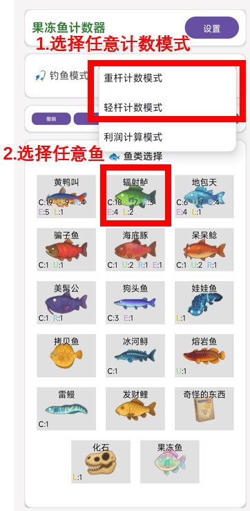
  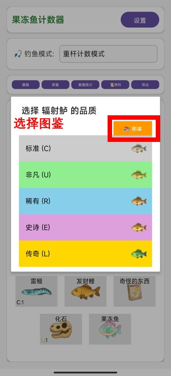
  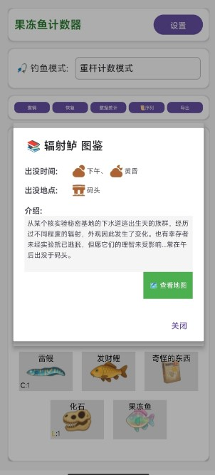

# 钓鱼计数

  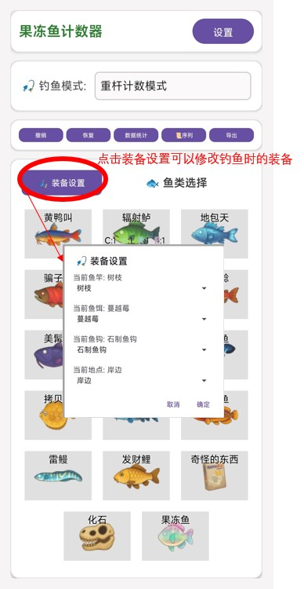
  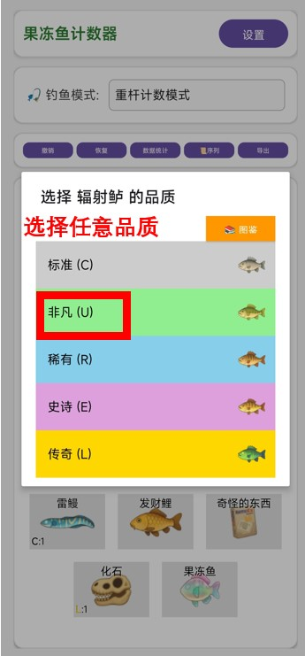
  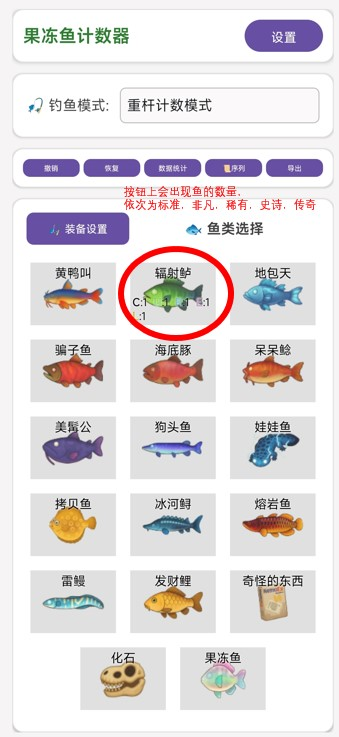

# 钓鱼序列

  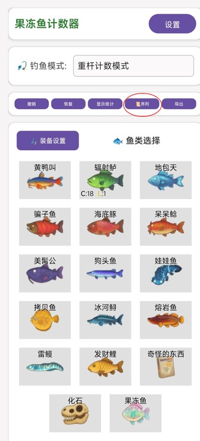
  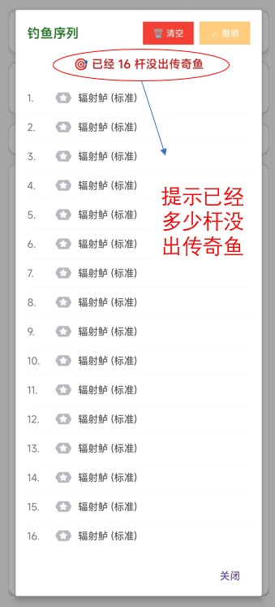
  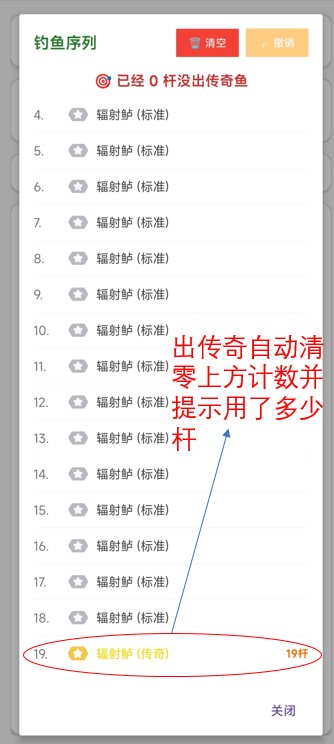

# 数据统计

  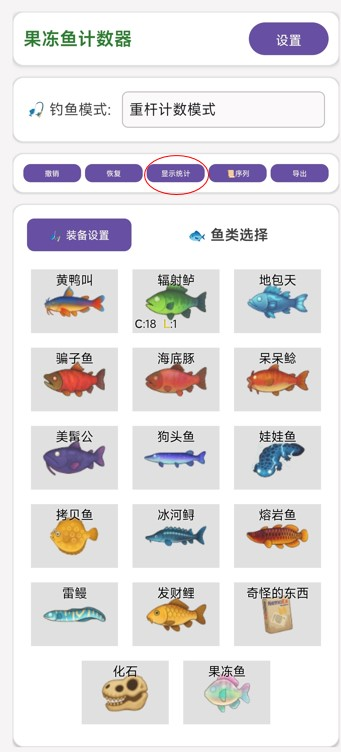
  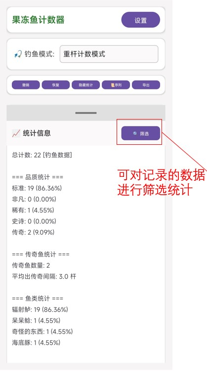
  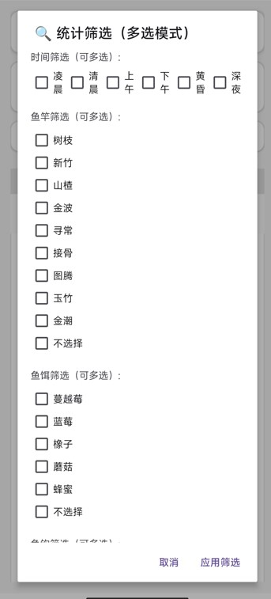

# 钓鱼利润计算

  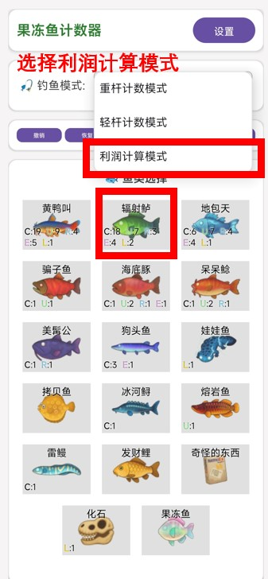
  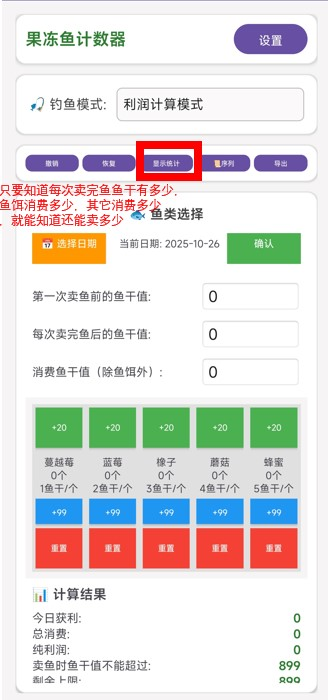
  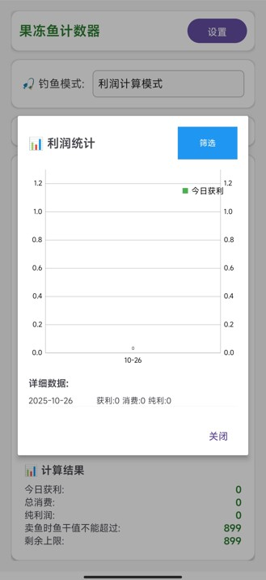
  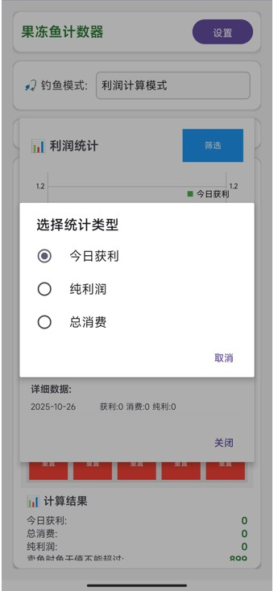

# 数据导入

  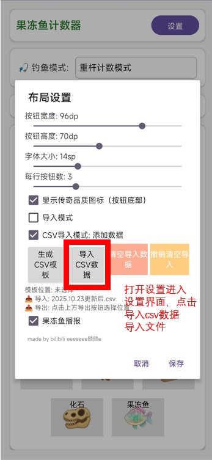
  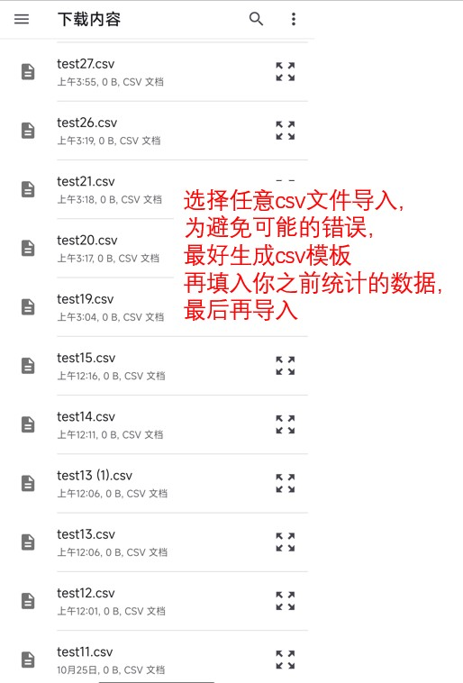
  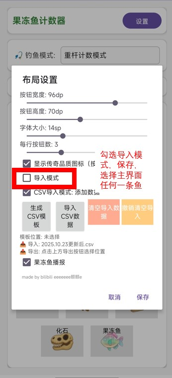
  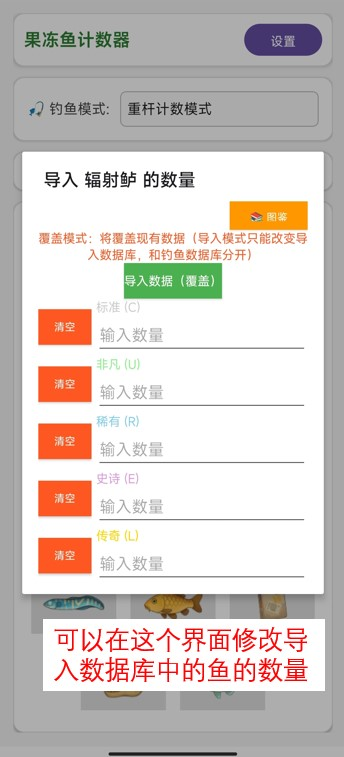

# 数据导出

  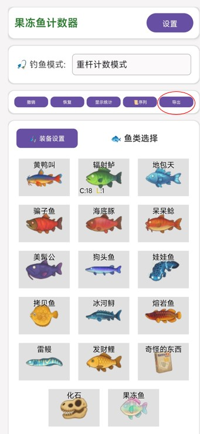
  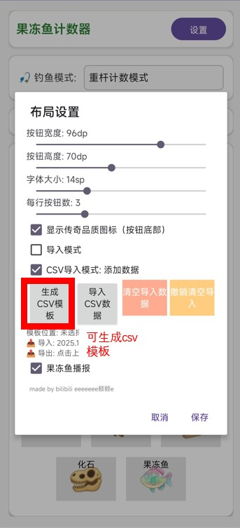

# 果冻鱼播报

  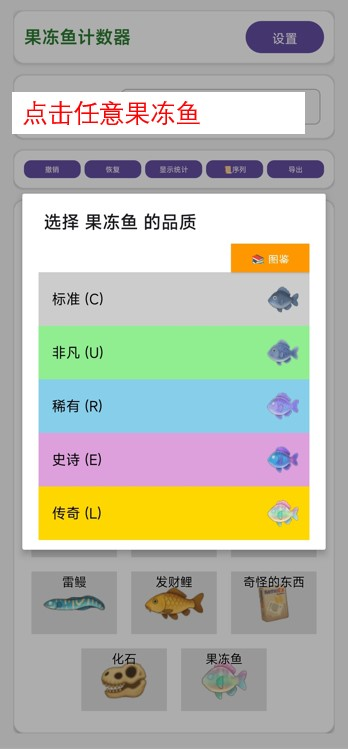
  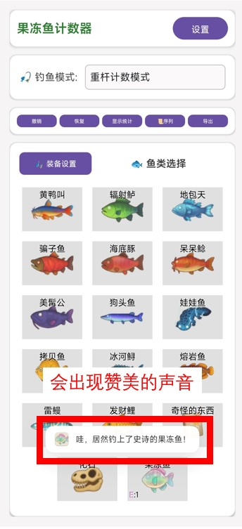

# 下载安装

前往 [Releases](https://github.com/86shadowglint-ui/party-animals-slimfishcounter/releases) 下载后在安卓系统上安装程序打开软件

---
作者：bilibili @eeeeeee额额e

如果喜欢本项目，可以微信赞赏送作者一杯咖啡☕

您的支持就是作者开发和维护项目的动力🚀

  

---

